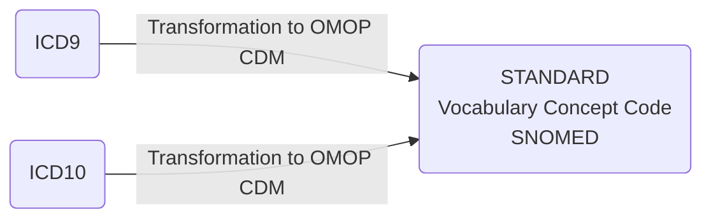
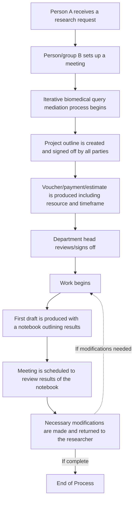

# ILAE
Resources for ILAE Big Data Commission

# Table of Contents

- [Epilepsy and OMOP](#epilepsy-and-OMOP)
- [OHDSI_Resources](#ohdsi-resources)
- [OMOP CDM Basic Data Dictionary](#omop-cdm-basic-data-dictionary)
- [Projects Best Suited for Observational Research and OHDSI Network Studies](#projects-best-suited-for-observational-research-and-ohdsi-network-studies)
- [Analytic Use Cases and Examples](#analytic-use-cases-and-examples)
- [Incremental Loading](#incremental-loading)
- [The Collaboration Process](#the-collaboration-process)
- [Data Content Ontology](#Data-Content-Ontology)
- [Current CDM](#current-cdm)
- [Commonly Used CDM Tables Overview](#commonly-used-cdm-tables-overview)
- [ETL Basics](#ETL-Basics)
- [OHDSI Analysis Tools](#ohdsi-analysis-tools)
- [Data Science Handbook](#data-science-handbook)
- [Programming Resources: Jupyter Notebooks, Python, R, and SQL](#Programming-Resources)
- [Recommended Trainings](#recommended-trainings)
- [Analysis with SQL](#analysis-with-sql)
- [Analysis with R](#analysis-with-r)
- [Diversity, Equity, and Inclusion Resources](#diversity-equity-and-inclusion-resources)

# Epilepsy and OMOP

| Title | Journal | Creation Date | Authors |
|-------|---------|---------------|---------|
| Risk of angioedema associated with levetiracetam compared with phenytoin: Findings of the observational health data sciences and informatics research network | [Epilepsia](https://pubmed.ncbi.nlm.nih.gov/28681416) | 2017/07/07 06:00 | Duke, Jon D \| Ryan, Patrick B \| Suchard, Marc A \| Hripcsak, George \| Jin, Peng \| Reich, Christian \| Schwalm, Marie-Sophie \| Khoma, Yuriy \| Wu, Yonghui \| Xu, Hua \| Shah, Nigam H \| Banda, Juan M \| Schuemie, Martijn J |
| Characterization of Anti-seizure Medication Treatment Pathways in Pediatric Epilepsy Using the Electronic Health Record-Based Common Data Model | [Frontiers in neurology](https://pubmed.ncbi.nlm.nih.gov/32477256/) | 2020/06/02 06:00 | Kim, Hunmin \| Yoo, Sooyoung \| Jeon, Yonghoon \| Yi, Soyoung \| Kim, Seok \| Choi, Sun Ah \| Hwang, Hee \| Kim, Ki Joong |
| Patient characteristics and antiseizure medication pathways in newly diagnosed epilepsy: Feasibility and pilot results using the common data model in a single-center electronic medical record database | [Epilepsy & behavior : E&B](https://pubmed.ncbi.nlm.nih.gov/35276502) | 2022/03/11 20:13 | Spotnitz, Matthew \| Ostropolets, Anna \| Castano, Victor G \| Natarajan, Karthik \| Waldman, Genna J \| Argenziano, Michael \| Ottman, Ruth \| Hripcsak, George \| Choi, Hyunmi \| Youngerman, Brett E |
| Identification of patients with drug-resistant epilepsy in electronic medical record data using the Observational Medical Outcomes Partnership Common Data Model | [Epilepsia](https://pubmed.ncbi.nlm.nih.gov/36106377) | 2022/09/15 03:02 | Castano, Victor G \| Spotnitz, Matthew \| Waldman, Genna J \| Joiner, Evan F \| Choi, Hyunmi \| Ostropolets, Anna \| Natarajan, Karthik \| McKhann, Guy M \| Ottman, Ruth \| Neugut, Alfred I \| Hripcsak, George \| Youngerman, Brett E |
| Conversion of the Canadian Observational Study on Epilepsy (CANOE) REDCap Registry to the OMOP Common Data Model |[2023 OHDSI Symposium Showcase](https://www.ohdsi.org/2023showcase-21/)| 2023/10/28 | Boyce, Danielle \| Josephson, Colin Bruce \| Jiang, Ray \| Wiebe, Samuel |


<div style="text-align: right"><a href="#table-of-contents">Back to Table of Contents</a></div>

# OMOP CDM Basic Data Dictionary 
For a sample interactive OMOP data dictionary, please click on the image below:
[](https://dbjhu.github.io/OMOPDD.html)
<div style="text-align: right"><a href="#table-of-contents">Back to Table of Contents</a></div>

# Projects Best Suited for Observational Research and OHDSI Network Studies
 

<div style="text-align: right"><a href="#table-of-contents">Back to Table of Contents</a></div>

# (This is the exact same table as in the image above only in Markdown)

## Analytic Use Cases and Examples

| Analytic use case                     | Type                        | Structure                                                                                                               | Example                                                                                                                   |
|---------------------------------------|-----------------------------|-------------------------------------------------------------------------------------------------------------------------|---------------------------------------------------------------------------------------------------------------------------|
| **Clinical characterization**         | Disease Natural History     | Amongst patients who are diagnosed with `<insert your favorite disease>`, what are the patient’s characteristics from their medical history? | Amongst patients with rheumatoid arthritis, what are their demographics (age, gender), prior conditions, medications, and health service utilization behaviors? |
|                                       | Treatment utilization       | Amongst patients who have `<insert your favorite disease>`, which treatments were patients exposed to amongst `<list of treatments for disease>` and in which sequence? | Amongst patients with depression, which treatments were patients exposed to SSRI, SNRI, TCA, bupropion, esketamine and in which sequence? |
|                                       | Outcome incidence           | Amongst patients who are new users of `<insert your favorite drug>`, how many patients experienced `<insert your favorite known adverse event from the drug profile>` within `<time horizon following exposure start>`? | Amongst patients who are new users of methylphenidate, how many patients experienced psychosis within 1 year of initiating treatment? |
| **Population-level effect estimation** | Safety surveillance         | Does exposure to `<insert your favorite drug>` increase the risk of experiencing `<insert an adverse event>` within `<time horizon following exposure start>`? | Does exposure to ACE inhibitor increase the risk of experiencing Angioedema within 1 month after exposure start? |
|                                       | Comparative effectiveness   | Does exposure to `<insert your favorite drug>` have a different risk of experiencing `<insert any outcome (safety or benefit)>` within `<time horizon following exposure start>`, relative to `<insert your comparator treatment>`? | Does exposure to ACE inhibitor have a different risk of experiencing acute myocardial infarction while on treatment, relative to thiazide diuretic? |
| **Patient level prediction**          | Disease onset and progression | For a given patient who is diagnosed with `<insert your favorite disease>`, what is the probability that they will go on to have `<another disease or related complication>` within `<time horizon from diagnosis>`? | For a given patient who is newly diagnosed with atrial fibrillation, what is the probability that they will go onto to have ischemic stroke in next 3 years? |
|                                       | Treatment response           | For a given patient who is a new user of `<insert your favorite chronically-used drug>`, what is the probability that they will `<insert desired effect>` in `<time window>`? | For a given patient with T2DM who start on metformin, what is the probability that they will maintain HbA1C <6.5% after 3 years? |
|                                       | Treatment safety             | For a given patient who is a new user of `<insert your favorite drug>`, what is the probability that they will experience `<insert adverse event>` within `<time horizon following exposure>`? | For a given patient who is a new user of warfarin, what is the probability that they will have GI bleed in 1 year? |

<div style="text-align: right"><a href="#table-of-contents">Back to Table of Contents</a></div>

## Important Paper About Implementation of the OMOP CDM!
[Erica A Voss, Clair Blacketer, Sebastiaan van Sandijk, Maxim Moinat, Michael Kallfelz, Michel van Speybroeck, Daniel Prieto-Alhambra, Martijn J Schuemie, Peter R Rijnbeek, European Health Data & Evidence Network—learnings from building out a standardized international health data network, Journal of the American Medical Informatics Association, 2023;, ocad214](https://doi.org/10.1093/jamia/ocad214)

<div style="text-align: right"><a href="#table-of-contents">Back to Table of Contents</a></div>

# Data Content Ontology


## Overview of Major Clinical Terminologies and Coding Systems

This document provides a detailed overview of several essential clinical terminologies and coding systems used in healthcare. Each system has a specific role and is crucial for standardized communication in healthcare settings. The information includes development history, usage, and updates of these systems.

For more in-depth information, links to the respective official websites are provided.

### SNOMED Clinical Terms (SNOMED CT)
- **Development:** Originally by the College of American Pathologists, now under SNOMED International.
- **Adoption:** Used in over 50 countries.
- **Concepts:** Over 340,000 active concepts in 19 hierarchies.
- **Usage:** Encodes clinical information including diseases, findings, and procedures.
- **Updates:** Biannual, with more frequent updates planned.
- **More Information:** [SNOMED International](https://www.snomed.org/snomed-ct)

### Logical Observation Identifiers Names and Codes (LOINC)
- **Developer:** Regenstrief Institute.
- **Function:** Identifiers for laboratory and clinical observations.
- **Content:** Over 90,000 terms.
- **Collaboration:** With SNOMED CT for coded content development.
- **Updates:** Biannual.
- **More Information:** [LOINC](https://loinc.org)

### RxNorm
- **Developer:** National Library of Medicine (NLM).
- **Function:** Standard nomenclature for medications.
- **Integration:** Links to various drug vocabularies.
- **Access:** Requires UMLS user license for proprietary content.
- **More Information:** [RxNorm - NLM](https://www.nlm.nih.gov/research/umls/rxnorm)

### International Classification of Disease (ICD)
- **Endorsement:** World Health Organization (WHO).
- **Versions:** ICD-10 widely used with national extensions; ICD-11 adopted for future use.
- **Purpose:** Epidemiology, health management, clinical purposes.
- **Updates:** Annual, freely available.
- **More Information:** [WHO ICD](https://www.who.int/classifications/icd)

### Current Procedural Terminology (CPT)
- **Developer:** American Medical Association (AMA).
- **Use:** Encoding of medical services and procedures in the USA.
- **Categories:** Three categories of codes.
- **Requirement:** License from AMA for use.
- **More Information:** [CPT - AMA](https://www.ama-assn.org/practice-management/cpt)

### Human Phenotype Ontology (HPO)
- **Function:** Bioinformatic resources for human diseases and phenotypes analysis.
- **Components:** Phenotype vocabulary, disease-phenotype annotations, algorithms.
- **Applications:** Genomic interpretation, gene-disease discovery, precision medicine.
- **Content:** Over 13,000 terms in 5 hierarchies.
- **Availability:** Freely available, multiple releases per year.
- **More Information:** [Human Phenotype Ontology](https://hpo.jax.org)

### Unified Medical Language System (UMLS)
- **Initiation:** By the US National Library of Medicine in 1986.
- **Goal:** To aid in the retrieval and integration of electronic biomedical information.
- **Challenge Addressed:** Different vocabularies expressing the same information differently.
- **Availability:** Free, but requires a license due to additional licensing requirements of some contents.
- **More Information:** [UMLS - NLM](https://www.nlm.nih.gov/research/umls)

### Ontology Mapping in BioPortal Applications
- **Process:** Finding the closest match of a code from one ontology in another.
- **Matching:** Exact equivalence is rare; approximate matching is common.
- **Challenges:** Labor-intensive and requires understanding the maps' nature and limitations.
- **Alternative Approach:** Mapping multiple ontologies to a central core terminology, as used by the OHDSI consortium.
- **More Information:** [BioPortal](https://bioportal.bioontology.org)

    <div style="text-align: right"><a href="#table-of-contents">Back to Table of Contents</a></div>

## OMOP Domains by Source to Standard Vocabulary

<div style="text-align: right"><a href="#table-of-contents">Back to Table of Contents</a></div>


| Domain                    | Source Vocabulary              | Standard Vocabulary       |
|---------------------------|--------------------------------|---------------------------|
| Conditions                | ICD9, ICD10                    | SNOMED                    |
| Measurements              | LOINC or institutional specific codes | LOINC               |
| Drugs                     | NDC                            | RxNORM                    |
| Procedures                | ICD9, ICD10, CPT               | SNOMED                    |   |

* ICD = International Classification of Diseases
* SNOMED = Systematized Nomenclature of Medicine
* LOINC = Logical Observation Identifiers Names and Codes
* NDC = National Drug Code
* CPT = Current Procedural Terminology

  <div style="text-align: right"><a href="#table-of-contents">Back to Table of Contents</a></div>


## Incremental Loading

Incremental loading in the context of OHDSI refers to the process of adding new or updated data to an existing OHDSI database without the need to completely rebuild or refresh the entire dataset. This can be particularly useful for large datasets where full loads can be time-consuming and inefficient. The process involves extracting only the changes since the last load and then transforming and loading this delta of data into the existing OMOP Common Data Model (CDM) used by OHDSI tools.

For instance, in the development of an ETL (Extract, Transform, Load) process for the bulk and incremental load of German patient data into the OMOP CDM using FHIR as referenced by OHDSI, it suggests that the incremental loading is an essential part of keeping the database up-to-date in an efficient manner​. [OHDSI Symposium Showcase #44](https://ohdsi.org/2021-global-symposium-showcase-44/#:~:text=,Reinecke%2C%20Michele%20Zoch%2C%20Martin%20Sedlmayr)

This group alos described a [Near Real-Time Incremental OMOP-CDM ETL System](https://www.ohdsi.org/wp-content/uploads/2021/09/14-abstract-lee.pdf)

This is also described by Dr. DuWayne Willett, CMIO of UTSW, at around minute 30 of this video:

[](https://www.youtube.com/watch?v=DPatSxFkIpI "OHDSI Symposium Presentation by Dr. DuWayne Willett")

...and in this OHDSI symposium presentation: .

<div style="text-align: right"><a href="#table-of-contents">Back to Table of Contents</a></div>


## The Collaboration Process 
### This is just an example of the kinds of diagrams we can make in Mermaid for our workflows


<div style="text-align: right"><a href="#table-of-contents">Back to Table of Contents</a></div>


## Current CDM


*Source: [OHDSI Common Data Model](https://ohdsi.github.io/CommonDataModel/index.html)*

<div style="text-align: right"><a href="#table-of-contents">Back to Table of Contents</a></div>


[Interactive (Select) OMOP Data Dictionary](https://github.com/DBJHU/DBJHU.github.io/blob/main/SelectOMOPDataDictionaryInteractivev2.html)

<div style="text-align: right"><a href="#table-of-contents">Back to Table of Contents</a></div>

# Commonly Used CDM Tables Overview
The OMOP common data model (CDM) is a relational database made up of different tables that relate to each other by foreign keys (XXXX_ID values; e.g., PERSON_ID or PROVIDER_ID). The OMOP tables in your data export are as follows:

| Table              | Description |
|--------------------|---------------------|
| Person             | Contains basic demographic information describing a participant, including biological sex, birth date, race, and ethnicity. |
| Visit_occurrence   | Captures encounters with healthcare providers or similar events. Contains the type of visit a person has (outpatient care, inpatient care, or long-term care), as well as the date and duration information. Rows in other tables can reference this table, for example, condition_occurrences related to a specific visit. |
| Condition_occurrence | Indicates the presence of a disease or medical condition stated as a diagnosis, a sign, or symptom, which is either observed by a provider or reported by the patient. |
| Drug_exposure      | Captures records about the utilization of a medication. Drug exposures include prescription and over-the-counter medicines, vaccines, and large-molecule biologic therapies. Radiological devices ingested or applied locally do not count as drugs. Drug exposure is inferred from clinical events associated with orders, prescriptions written, pharmacy dispensing, procedural administrations, and other patient-reported information. |
| Measurement        | Contains both orders and results of a systematic and standardized examination or testing of a participant or participant's sample, including laboratory tests, vital signs, quantitative findings from pathology reports, etc. |
| Procedure_occurrence | Contains records of activities or processes ordered by or carried out by a healthcare provider on the patient to have a diagnostic or therapeutic purpose. |
| Observation        | Captures clinical facts about a person obtained in the context of an examination, questioning, or a procedure. Any data that cannot be represented by another domain, such as social and lifestyle facts, medical history, and family history, are recorded here. |
| Device_exposure    | Captures information about a person's exposure to a foreign physical object or instrument which is used for diagnostic or therapeutic purposes. Devices include implantable objects, blood transfusions, medical equipment and supplies, other instruments used in medical procedures, and material used in clinical care. |
| Death              | Contains the clinical events surrounding how and when a participant dies. |

<div style="text-align: right"><a href="#table-of-contents">Back to Table of Contents</a></div>

# OMOP Data Quality
[The Book of OHDSI - Chapter 15: Data Quality](https://ohdsi.github.io/TheBookOfOhdsi/DataQuality.html)

[Kahn MG, Callahan TJ, Barnard J, Bauck AE, Brown J, Davidson BN, Estiri H, Goerg C, Holve E, Johnson SG, Liaw ST, Hamilton-Lopez M, Meeker D, Ong TC, Ryan P, Shang N, Weiskopf NG, Weng C, Zozus MN, Schilling L. A Harmonized Data Quality Assessment Terminology and Framework for the Secondary Use of Electronic Health Record Data. EGEMS (Wash DC). 2016 Sep 11;4(1):1244. doi: 10.13063/2327-9214.1244. PMID: 27713905; PMCID: PMC5051581.](https://www.ncbi.nlm.nih.gov/pmc/articles/PMC5051581/)


# ETL Basics
https://www.ohdsi.org/wp-content/uploads/2019/09/OMOP-Common-Data-Model-Extract-Transform-Load.pdf
https://ohdsi.github.io/TheBookOfOhdsi/ExtractTransformLoad.html

<div style="text-align: right"><a href="#table-of-contents">Back to Table of Contents</a></div>

## ETL STEPS 
1. **Dataset profiling and documentation**
    - Create data model documentation, sample data, data dictionaries, code lists, and other relevant information (23-Aug)
    - Execute database profiling scan (WhiteRabbit) on source database
    - Prepare mapping approach/documents based on scan reports from database profiling scan

2. **Generation of the ETL Design**
    - Mapping workshop with all relevant parties to:
        1. Understand the source
        2. Define the scope of source data to be transformed
        3. Define acceptance criteria for OMOP output
        - Output: draft mapping document
    - Finalize mapping document:
        - Integrate all notes/documentation from workshop
        - Work through mappings and verify, update, fill in gaps
        - Meetings/emails with data contact/technical contact (TC) as needed

3. **Source Data Integrations and Semantic Mapping**
    - Source Code mapping:
        - Identify which codes are already mapped to standard vocabulary
        - Identify code types for codes that need to be mapped
        - Translation of code description/phrases to English, if/as needed
        - Create proposed code mappings
    - Generate mappings for data coming out of flowsheets (together with consortium)
    - Review/approval of code mappings, often done by medical experts affiliated with Data Owner (DO). 
    - Identify medical imaging available and define mappings to Imaging Extension
    - Identify waveform data available and map using consortium-defined guidelines
    - Use OHNLP to extract OMOP data from unstructured sources

4. **Technical architecture design**
    - Continuous Integration, Continuous Deployment (CI/CD):
        - Decide on ETL dev/deployment flow
        - Put version control mechanisms in place
    - OHDSI Ecosystem:
        - Evaluate infrastructure needed
        - Create infrastructure design documentation

5. **Technical ETL Development**
    - Implement ETL (Preferred Language/Structure?)
    - Update ETL based on testing/QA/feedback (8, 9)

6. **Setting up of Infrastructure**
    - Deploy core servers and associated services based on infrastructure design in (4)

7. **Installation of the OHDSI tools**
    - Install and configure all software (database server, Achilles/DQD/Ares, Atlas/WebAPI, R Studio server, HADES, notebooks/tooling related to analytics, and any other software to suit a site’s specific needs).

8. **ETL Testing and Validation**
    - ETL Execution:
        - Test ETL using sample/development data (with limited external data access)
        - Test ETL using DO data (with full external data access)
        - Verify and document QA
        - Submit Achilles/DQD/AresIndexer results to central location regularly
    - ETL Development Planning and Management:
        - Review ETL testing and progress (TCs/meetings)

9. **Data Quality Assessment**
    - QA/Acceptance testing:
        - Evaluate accuracy and completeness of mapping
        - Review and approval by DO

10. **Documentation**
    - Mapping Documentation and Themis Checks
    - Transformation/Technical Documentation

11. **Project Management Througout**
    - Organization of tasks, milestones, and follow-up

# OHDSI Analysis Tools
R, SQL, Python, or any preferred data analysis software. Examples provided below are for R and SQL.
[The Book of OHDSI Chapter 9] (https://ohdsi.github.io/TheBookOfOhdsi/SqlAndR.html) provides an overview of analysis of OHDSI data in R and SQL; note that you will not be able to avail yourselves of OHDSI software tools when analyzing your exported data for the reason explained above.

<div style="text-align: right"><a href="#table-of-contents">Back to Table of Contents</a></div>

## Data Science Handbook
[Open, rigorous and reproducible research: A practitioner’s handbook](https://datascience.stanford.edu/programs/stanford-data-science-scholars-program/data-science-handbook) 
From Standord Data Science

<div style="text-align: right"><a href="#table-of-contents">Back to Table of Contents</a></div>

# Programming Resources
## Jupyter Notebooks, Python, SQL, and R Programming Resources

- [Project Jupyter](https://jupyter.org/)
- [What is the Jupyter Notebook?](https://jupyter-notebook-beginner-guide.readthedocs.io/en/latest/what_is_jupyter.html)
- [NIAID NIH Informatics resources](https://bioinformatics.niaid.nih.gov/resources)

Software Carpentry is a website that provides free online lessons to researchers wanting to enhance their programming skills for data analysis. This website offers free online lessons on a variety of useful topics including:

- [Programming with Python](http://swcarpentry.github.io/python-novice-inflammation/)
- [Programming with R](http://swcarpentry.github.io/r-novice-inflammation/)
- [Databases and SQL](http://swcarpentry.github.io/sql-novice-survey/)

Additional resources:

- [DataCamp](http://www.datacamp.com/)
- [Khan Academy](https://www.khanacademy.org/computing/computer-programming/sql/sql-basics/v/welcome-to-sql)
- [Codecademy - Learn Python 2](https://www.codecademy.com/learn/learn-python)
- [Python Data Science Handbook](https://jakevdp.github.io/PythonDataScienceHandbook/)
- [R for Data Science](https://r4ds.had.co.nz/)
- [Introduction to Programming (NIAID, NIH)](https://bioinformatics.niaid.nih.gov/resources - 70.3.1)
- [Python Programming (NIAID, NIH)](https://bioinformatics.niaid.nih.gov/resources - 70.3.2)
- [Data Analysis with Python and Pandas (NIAID, NIH)](https://bioinformatics.niaid.nih.gov/resources - 70.3.3)
- [Data Visualization with Python (NIAID, NIH)](https://bioinformatics.niaid.nih.gov/resources - 70.3.4)
- [Source:NIH All of US Study](https://support.researchallofus.org/hc/en-us/articles/360039690191-Jupyter-Notebooks-and-programming)

<div style="text-align: right"><a href="#table-of-contents">Back to Table of Contents</a></div>

# OHDSI Resources
Hello! Please familiarize yourself with the following tools and resources which will help you throughout this course and your OHDSI journey.

Check out the [**OHDSI Forums**](https://forums.ohdsi.org/) *Introduce yourself on the "Welcome to OHDSI" thread.*

Bookmark [**The Book of OHDSI**](https://ohdsi.github.io/TheBookOfOhdsi/)

Check out [**OHOP CDM FAQ**](https://ohdsi.github.io/CommonDataModel/faq.html)

Join the OHDSI [**Microsoft Teams**](https://forms.office.com/Pages/ResponsePage.aspx?id=lAAPoyCRq0q6TOVQkCOy1ZyG6Ud_r2tKuS0HcGnqiQZUQ05MOU9BSzEwOThZVjNQVVFGTDNZRENONiQlQCN0PWcu) environment.

Check out the [**MIMIC-IV demo data set**](https://physionet.org/content/mimic-iv-demo-omop/0.9/1_omop_data_csv/) in OMOP CDM format!

Register with [**EHDEN Academy**](https://academy.ehden.eu/)

Visit the [**Atlas Demo**](https://atlas-demo.ohdsi.org/) and [**Athena**](https://athena.ohdsi.org/search-terms/start).

Bookmark the [**OHDSI YouTube tutorials and workshops**](https://youtube.com/playlist?list=PLpzbqK7kvfeXRQktX0PV-cRpb3EFA2e7Z)

Visit the [**OHDSI Community Dashboard**](https://dash.ohdsi.org/)

Bookmark [**OMOP Common Data Model (ohdsi.github.io)**](https://ohdsi.github.io/CommonDataModel/index.html)

[**Learn about GitHub**](https://docs.github.com/en/get-started/quickstart/hello-world) if you don't already know.

Plan to attend an [**OHDSI Community call**](https://ohdsi.org/community-calls/)

Learn about OHDSI [**Workgroups**](https://ohdsi.org/upcoming-working-group-calls/)

Follow OHDSI on social media: [**Twitter**](https://twitter.com/OHDSI) [**LinkedIn**](https://www.linkedin.com/company/ohdsi)

[**Subscribe**](https://ohdsi.org/subscribe-to-our-newsletter/) to the OHDSI Newsletter

Learn about past and [**upcoming OHDSI events**](https://ohdsi.org/2023-ohdsi-events/)

Learn about OHDSI [**software**](https://ohdsi.org/software-tools/)

Look up individual concepts in [Athena](https://athena.ohdsi.org/)

Check out useful OHDSI-related documentation here: [NIH ALL of US OMOP Documentation](https://support.researchallofus.org/hc/en-us/articles/360039585391-How-the-Observational-Medical-Outcomes-Partnership-OMOP-vocabulary-are-structured)

<div style="text-align: right"><a href="#table-of-contents">Back to Table of Contents</a></div>

# Special Topic:  Cinical Registries Using OHDSI

[](https://youtu.be/DPatSxFkIpI?si=VOqE4VTlzIcxuWdP)

[Clinical Registries in OHDSI - September 2022](https://www.ohdsi.org/wp-content/uploads/2022/09/OHDSI-Clinical_Registries.pdf)

# Special topic: SSSOM

https://www.ohdsi.org/wp-content/uploads/2023/10/Talapova-Polina_Mapping_of_Critical_Care_EHR_Flowsheet_data_to_the_OMOP_CDM_via_SSSOM_2023symposium-Polina-Talapova.pdf

Matentzoglu N, Balhoff JP, Bello SM, Bizon C, BrushM, Callahan TJ et al. A Simple Standard
for Sharing Ontological Mappings (SSSOM). Database. 2022. 2022:baac035, DOI:
10.1093/database/baac035.

Mapping Commons. SSSOM: Simple Standard for Sharing Ontological Mappings. Wiki [Internet].
Available from: https://mapping-commons.github.io/sssom/about.

Mapping Commons. SSSOM: Simple Standard for Sharing Ontological Mappings. GitHub
[Internet]. Available from: https://github.com/mapping-commons/sssom.

https://www.w3.org/2004/02/skos/

# Recommended Trainings
## OHDSI Community
  **Broadsea3.0**  
  By: Lee Evans  
 [](https://youtu.be/CNlsZzY7VrM)


<div style="text-align: right"><a href="#table-of-contents">Back to Table of Contents</a></div>

## Tufts Bridge2AI Standards Module
- **June 15, 2023:**  
  **Data Quality Dashboard**  
  By: Jared Houghtaling  
  [](https://youtu.be/O2L1x0Sv3lc)

- **July 6, 2023:**  
  **Data Quality Dashboard output demo**  
  By: Jared Houghtaling  
  [](https://youtu.be/qYDq5-dg-io)

- **July 13, 2023:**  
  **Achilles output demo**  
  By: Jared Houghtaling  
  [](https://youtu.be/bIRQVgcnAwI)

- **July 27, 2023:**  
  **Flowsheet follow-up**  
  By: Polina Talapova & Jared Houghtaling  
  [](https://youtu.be/3cTT2XJZslI)

- **August 3, 2023:**  
  **OMOP Standardized Vocabularies - Part 1**  
  By: Jared Houghtaling and Polina Talapova  
  [](https://youtu.be/4xnH7-oJxyo)

- **August 17, 2023:**  
  **OMOP Standardized Vocabularies - Part 2**  
  By: Polina Talapova  
  [](https://youtu.be/1J7ISUASx6k)

- **August 24, 2023:**  
  **How to download and set-up a DDL (Demo)**  
  By: Jared Houghtaling  
  [](https://youtu.be/x9W3sa1xGoQ)

- **August 31, 2023:**  
  **Demo of WhiteRabbit and RabbitInAHat**  
  By: Jared Houghtaling  
  [](https://youtu.be/gu1fQVwkBo8)

- **September 7, 2023:**  
  **ARES usefulness for ETL at Tufts**  
  By: Jared Houghtaling  
  [](https://youtu.be/Czox3WT1pDM)

- **September 14, 2023:**  
  **Google form introduction for site progress tracking**  
  By: Jared Houghtaling  
  [](https://youtu.be/ntZwikqhIcM)

- **September 21, 2023:**  
  **Sample ETL Process**  
  By: Jared Houghtaling  
  [](https://youtu.be/uX289BrzXM4)

**October 12, 2023:**  
  **Google Form for Site Progress Tracking**  
  With Jared Houghtaling and Andrew Williams  
  [](https://youtu.be/oTP6ISo8FWc)

- **October 26, 2023:**  
  **Review and Prioritization of DQD Results, and Discussion of DQD Issue Severity**  
  With Jared Houghtaling  
  [](https://youtu.be/dJr5tkm-Ex4)

- **November 2, 2023:**  
  **Principles of Mapping and Vocab Gaps Identification**  
  With Polina Talapova  
  [](https://youtu.be/jOKzb3x6hmo)

- **November 9, 2023:**  
  **Usagi & STCM Demo**  
  With Polina Talapova & Jared Houghtailing  
  [](https://youtu.be/hNhph-elrp4)


<div style="text-align: right"><a href="#table-of-contents">Back to Table of Contents</a></div>

# Diversity, Equity, and Inclusion Resources

- [How racial biases in medical algorithms lead to inequities in care | PBS News Weekend](https://www.pbs.org/newshour/show/how-racial-biases-in-medical-algorithms-lead-to-inequities-in-care)
- [AI Reveals its Biases by Generating What it Thinks Professors Look Like | PetaPixel](https://petapixel.com/2023/05/04/ai-reveals-its-biases-by-generating-what-it-thinks-professors-look-like/)
- [Does “AI” stand for augmenting inequality in the era of covid-19 healthcare? | The BMJ](https://www.bmj.com/content/372/bmj.n304)
- [The AUC Data Science | Initiative (aucenter.edu)](https://datascience.aucenter.edu/)
- [ReCode-Report.pdf (data.org)](https://datascience.aucenter.edu/)
- [ADDI Researcher Roundtable: The Importance of Diversity in Dementia Research on Vimeo](https://vimeo.com/799212327?forcedownload=true&_=4007b451dfc8424fa5226c4615e147ea)
- [Advancing Antiracism, Diversity, Equity, and Inclusion in STEMM Organizations: Beyond Broadening Participation |The National Academies Press](https://nap.nationalacademies.org/catalog/26803/advancing-antiracism-diversity-equity-and-inclusion-in-stemm-organizations-beyond)
- [Data Literacy: The Composition Effect | Education | St. Louis Fed (stlouisfed.org)](https://www.stlouisfed.org/education/the-composition-effect)
- [A lecture by Pilar Ossorio at MLHC Professor of Law and Bioethics at the University of Wisconsin Law School](https://www.youtube.com/watch?v=DzGSlWu4Lj0&list=PLRqwW7v078fYdZFpf43d0NBh4hiGCRtfV&index=6)
- [This paper by Dunkelau and Leuschel that summarizes Fairness-aware Machine Learning](https://www.phil-fak.uni-duesseldorf.de/fileadmin/Redaktion/Institute/Sozialwissenschaften/Kommunikations-_und_Medienwissenschaft/KMW_I/Working_Paper/Dunkelau___Leuschel__2019__Fairness-Aware_Machine_Learning.pdf)
- [Paper by Gichoya et al about minimixing bias in AI](https://www.ncbi.nlm.nih.gov/pmc/articles/PMC10546443/)
- [A conversation with Cathy O’Neil, author of the critically acclaimed Weapons of Math Destruction - YouTube](https://www.youtube.com/watch?v=1QlIbed_Hwg)
- [Nicole G. Weiskopf (NYU) and Carolyn Thompson (UCSD) – Bias in EHR - YouTube](https://youtu.be/8V-yO7GNNlw?feature=shared)
- [This Obermeyer et al paper on dissecting racial bias in an algorithm used to manage the health of populations - Science, 2019](https://science.sciencemag.org/content/366/6464/447)
- [Fair ML Keynote talk + Microsoft talk + slides - Science, 2019](https://science.sciencemag.org/content/366/6464/447)
- [Maria Hightower, M.D., M.B.A., MPH Chief Digital Technology officer of the University of Chicago Medicine comments on the racial bias in AI and the algorithm described above - Science, 2019](https://science.sciencemag.org/content/366/6464/447)
- [How scientists are subtracting race from medical risk calculators - Science, 2021](https://science.sciencemag.org/content/366/6464/447)
- [This paper summarizes how being aware of a protected class can lead to differences in fairness outcomes - Science](https://science.sciencemag.org/content/366/6464/447)
- [Race After Technology, by Ruha Benjamin [Professor of African American studies at Princeton University], summarizes how technology [from data collection, data imputation, government policy, etc] can play a role in different outcomes in society - Science](https://science.sciencemag.org/content/366/6464/447)


## Analysis with SQL (OHDSI/OMOP)

The [OMOP Query Library](https://data.ohdsi.org/QueryLibrary/) is a library of commonly-used SQL queries for the OMOP Common Data Model (CDM).


## Analysis with R
Below are some sample R queries that demonstrate how to read in OMOP tables from CSV files, join them based on the `person_id` and `visit_occurrence_id` fields, and search for specific criteria.

Note: Adjust the file paths and column names accordingly based on the actual structure and location of your CSV files. The queries below are a generic representation and may need adjustments based on the specifics of your data set.

### Reading CSV files into R data frames:

```R
# Read the CSV files into R data frames
person_df <- read.csv("path_to_person_table.csv", header=TRUE, stringsAsFactors=FALSE)
visit_occurrence_df <- read.csv("path_to_visit_occurrence_table.csv", header=TRUE, stringsAsFactors=FALSE)
condition_occurrence_df <- read.csv("path_to_condition_occurrence_table.csv", header=TRUE, stringsAsFactors=FALSE)
```
Join tables based on `person_id`:

When a person has multiple visits in the `visit_occurrence` table, joining the `person` table with the `visit_occurrence` table will result in multiple rows for that person, each corresponding to a different visit. This is a standard one-to-many join operation.

```R
## Join person with visit_occurrence on 'person_id'
person_visit_df <- merge(person_df, visit_occurrence_df, by="person_id")
```

### Joining the Person-Visit table with the Condition Occurrence table:

```R
# Join the person-visit result with condition_occurrence on both 'person_id' and 'visit_occurrence_id'
full_df <- merge(person_visit_df, condition_occurrence_df, by=c("person_id", "visit_occurrence_id"))
```

### Search by a list of `person_ids`:

```R
# Define a list of person_ids to search for
search_person_ids <- c(1, 2, 3, 4, 5)

# Filter the data frame to only include rows with person_ids in the list
filtered_by_person_df <- subset(full_df, person_id %in% search_person_ids)
```

### Search by a specific condition concept code:

```R
# Define a specific condition concept code to search for
search_condition_concept_id <- 1234567

# Filter the data frame to only include rows with the specified condition concept code
filtered_by_condition_df <- subset(full_df, condition_concept_id == search_condition_concept_id)
```

### Search by a date range:

```R
# Define a date range to search for
start_date <- as.Date("2020-01-01")
end_date <- as.Date("2020-12-31")

## Filter the data frame to only include rows within the date range
filtered_by_date_df <- subset(full_df, visit_start_date >= start_date & visit_start_date <= end_date)
```
<!--TBD
## Analysis with Python 

### Required Python Libraries:

To execute the Python queries, you'll need to install the pandas library. -->


<div style="text-align: right"><a href="#table-of-contents">Back to Table of Contents</a></div>
<!--- WIP 

# OMOP ETL Process: Common Problems and Solutions

## Design and Planning
| Problem | Suggestion |
| ------- | ---------- |
| Different Coding Schemes in Databases | Standardize structures, conventions, and content during ETL to align different coding schemes. |
| Designing ETL with Expert Collaboration | Collaborate between data and CDM experts for efficient design. |
| Inadequate Source Data Documentation | Use White Rabbit to scan and understand source data thoroughly. |
| Mapping Source Data to CDM | Use Rabbit-in-a-Hat tool for interactive mapping and documentation. |
| Mapping Non-OMOP Coding Systems | Focus on frequently used codes and utilize existing mappings where possible. |
| Handling Post Coordinated SNOMED Codes | Address challenges with codes or conditions occurring multiple times. |
| Integration of New Data Sources | Develop a flexible ETL process to integrate new data sources. |
| Handling Various Data Formats | Create processes to handle different data formats effectively. |
| Custom Code Development for ETL | Develop custom code when necessary for specific ETL requirements. |
| Adapting to CDM Updates | Adapt ETL processes to accommodate updates in the CDM. |

## Implementation and Technology
| Problem | Suggestion |
| ------- | ---------- |
| ETL Implementation | Utilize existing code and community resources for efficient ETL process implementation. |
| Choosing ETL Implementation Technology | Select technology based on site expertise (SQL, SAS, C#, Java, etc.). |
| Data Transformation Logic | Clearly define and document the logic for data transformations. |
| ETL Performance Optimization | Continuously monitor and optimize ETL performance. |
| Scalability of ETL Processes | Ensure that ETL processes are scalable to accommodate growing data. |
| Data Mapping Complexities | Address complexities in mapping data from various sources to the CDM. |
| Updating and Maintenance of ETL Scripts | Regularly update and maintain ETL scripts for consistency. |
| Managing ETL Dependencies | Identify and manage dependencies in the ETL process. |
| Cross-Database Compatibility | Ensure compatibility of ETL processes across different databases. |
| Optimizing Data Load Processes | Optimize data load processes to enhance performance. |

## Data Quality and Security
| Problem | Suggestion |
| ------- | ---------- |
| Data Quality Issues | Implement thorough quality control measures to ensure data integrity. |
| Large Dataset Handling | Optimize ETL processes for handling large datasets efficiently. |
| Missing or Incomplete Data | Develop strategies to handle missing or incomplete data elements. |
| Handling Data Anomalies | Develop procedures to identify and resolve data anomalies. |
| Data Security and Compliance | Maintain strict adherence to data security and compliance standards. |
| Data Validation Processes | Implement robust data validation processes to ensure accuracy. |
| Error Handling in ETL Process | Develop comprehensive error handling mechanisms. |
| Source Data Version Control | Maintain version control for source data to track changes. |
| Data Cleansing Procedures | Establish data cleansing procedures to improve data quality. |
| Complex Transformation Rules | Manage complex transformation rules efficiently. |

## Operational Management
| Problem | Suggestion |
| ------- | ---------- |
| Automation of ETL Processes | Explore opportunities to automate repetitive ETL tasks. |
| Resource Allocation for ETL Tasks | Allocate sufficient resources for ETL tasks. |
| Maintaining Data Lineage | Keep track of data lineage throughout the ETL process. |
| Balancing ETL Speed and Accuracy | Balance the need for speed with accuracy in ETL processes. |
| Training for ETL Team | Provide comprehensive training for the ETL team. |
| Standardizing ETL Practices | Standardize ETL practices across various projects. |
| Monitoring ETL Processes | Implement monitoring tools to oversee ETL processes. |
| Dealing with Data Duplication | Develop strategies to handle data duplication issues. |
| Dynamic Data Source Integration | Integrate dynamic data sources effectively into the ETL process. |
| Data Transformation Standardization | Standardize data transformation rules across different datasets. |
| Collaboration and Communication | Foster collaboration and communication among all stakeholders involved in the ETL process. | 
-->


```markdown
## Markdown Content for GitHub Tutorial

# Tutorial for Analyzing Type 2 Diabetes First Occurrence in OMOP CDM Data

This tutorial demonstrates how to create a flat file that consolidates information for each `person_id` based on the first occurrence of type 2 diabetes (standard concept ID 201826) using various data analysis tools: SQL, SAS, R, Stata, and SPSS.

Remember to adjust file paths and variable specifics according to your dataset.

## SQL

### Loading Data
Assuming the data are already loaded into a SQL database.

### SQL Query
```sql
SELECT
    p.*,
    vo.*,
    co.condition_occurrence_id,
    de.drug_exposure_id,
    m.measurement_id
FROM
    person p
JOIN
    condition_occurrence co ON p.person_id = co.person_id
JOIN
    visit_occurrence vo ON co.visit_occurrence_id = vo.visit_occurrence_id
LEFT JOIN
    drug_exposure de ON p.person_id = de.person_id AND vo.visit_occurrence_id = de.visit_occurrence_id
LEFT JOIN
    measurement m ON p.person_id = m.person_id AND vo.visit_occurrence_id = m.visit_occurrence_id
WHERE
    co.condition_concept_id = 201826
AND
    co.condition_start_date = (
        SELECT MIN(condition_start_date)
        FROM condition_occurrence
        WHERE person_id = co.person_id AND condition_concept_id = 201826
    )
GROUP BY
    p.person_id;
```

## SAS

### Loading Data
```sas
libname mydata '/path/to/csv/files';

proc import datafile="/path/to/csv/person.csv" 
    out=mydata.person 
    dbms=csv 
    replace;
run;

… [Repeat for other CSV files]
```

### SAS Code
```sas
proc sql;
    create table first_diabetes_visit as
    select
        p.*,
        vo.*,
        co.condition_occurrence_id,
        de.drug_exposure_id,
        m.measurement_id
    from
        mydata.person p
    inner join
        mydata.condition_occurrence co on p.person_id = co.person_id
    inner join
        mydata.visit_occurrence vo on co.visit_occurrence_id = vo.visit_occurrence_id
    left join
        mydata.drug_exposure de on p.person_id = de.person_id and vo.visit_occurrence_id = de.visit_occurrence_id
    left join
        mydata.measurement m on p.person_id = m.person_id and vo.visit_occurrence_id = m.visit_occurrence_id
    where
        co.condition_concept_id = 201826
    and
        co.condition_start_date = (
            select min(condition_start_date)
            from mydata.condition_occurrence
            where person_id = co.person_id and condition_concept_id = 201826
        )
    group by
        p.person_id;
quit;
```

## R

### Loading Data
```R
library(readr)

person <- read_csv("path/to/csv/person.csv")
visit_occurrence <- read_csv("path/to/csv/visit_occurrence.csv")
condition_occurrence <- read_csv("path/to/csv/condition_occurrence.csv")
drug_exposure <- read_csv("path/to/csv/drug_exposure.csv")
measurement <- read_csv("path/to/csv/measurement.csv")
```

### R Code
```R
library(dplyr)

first_diabetes_visit <- condition_occurrence %>%
  filter(condition_concept_id == 201826) %>%
  group_by(person_id) %>%
  summarize(first_diagnosis_date = min(condition_start_date)) %>%
  inner_join(visit_occurrence, by = "person_id") %>%
  inner_join(person, by = "person_id") %>%
  left_join(drug_exposure, by = c("person_id", "visit_occurrence_id")) %>%
  left_join(measurement, by = c("person_id", "visit_occurrence_id")) %>%
  filter(condition_start_date == first_diagnosis_date)

write.csv(first_diabetes_visit, "first_diabetes_visit.csv", row.names = FALSE)
```

## Stata

### Loading Data
```stata
import delimited "path/to/csv/person.csv", clear
save person, replace

… [Repeat for other CSV files]
```

### Stata Code
```stata
Assuming data are already loaded and named appropriately
merge 1:1 person_id using condition_occurrence
merge 1:1 person_id using visit_occurrence
merge 1:1 person_id using drug_exposure
merge 1:1 person_id using measurement

Filtering for first occurrence of type 2 diabetes
egen min_date = min(cond(condition_concept_id == 201826, condition_start_date, .)), by(person_id

)
keep if condition_start_date == min_date

Exporting the dataset
export delimited using "first_diabetes_visit.csv", replace
```

## SPSS

### Loading Data
```spss
GET DATA
  /TYPE=TXT
  /FILE='path/to/csv/person.csv'
  /DELCASE=LINE
  /DELIMITERS=","
  /ARRANGEMENT=DELIMITED
  /FIRSTCASE=2
  /VARIABLES=
  … [Variable names and types]
CACHE.
EXECUTE.

… [Repeat for other CSV files]
```

### SPSS Code
```spss
MATCH FILES
  /FILE=*
  /TABLE='condition_occurrence'
  /BY person_id.
MATCH FILES
  /FILE=*
  /TABLE='visit_occurrence'
  /BY person_id.
MATCH FILES
  /FILE=*
  /TABLE='drug_exposure'
  /BY person_id.
MATCH FILES
  /FILE=*
  /TABLE='measurement'
  /BY person_id.

Filtering for first occurrence of type 2 diabetes.
AGGREGATE OUTFILE=* MODE=ADDVARIABLES OVERWRITE=YES
/BREAK=person_id
/first_diagnosis_date=MIN(condition_start_date (condition_concept_id = 201826)).

SELECT IF condition_start_date = first_diagnosis_date.

Exporting the dataset.
SAVE OUTFILE='path/to/output/first_diabetes_visit.sav'.
```

## Python

### Loading Data
```python
import pandas as pd

person = pd.read_csv('path/to/csv/person.csv')
visit_occurrence = pd.read_csv('path/to/csv/visit_occurrence.csv')
condition_occurrence = pd.read_csv('path/to/csv/condition_occurrence.csv')
drug_exposure = pd.read_csv('path/to/csv/drug_exposure.csv')
measurement = pd.read_csv('path/to/csv/measurement.csv')
```

### Python Code
```python
Filtering for first occurrence of type 2 diabetes
first_diagnosis = condition_occurrence[condition_occurrence['condition_concept_id'] == 201826]
first_diagnosis = first_diagnosis.groupby('person_id')['condition_start_date'].min().reset_index()

Merging with other dataframes
merged_data = first_diagnosis.merge(visit_occurrence, on='person_id')
merged_data = merged_data.merge(person, on='person_id')
merged_data = merged_data.merge(drug_exposure, on=['person_id', 'visit_occurrence_id'], how='left')
merged_data = merged_data.merge(measurement, on=['person_id', 'visit_occurrence_id'], how='left')

Filtering to keep only records corresponding to the first diabetes diagnosis
merged_data = merged_data[merged_data['condition_start_date'] == merged_data['first_diagnosis_date']]

Exporting the dataset
merged_data.to_csv('first_diabetes_visit.csv', index=False)
```
```


